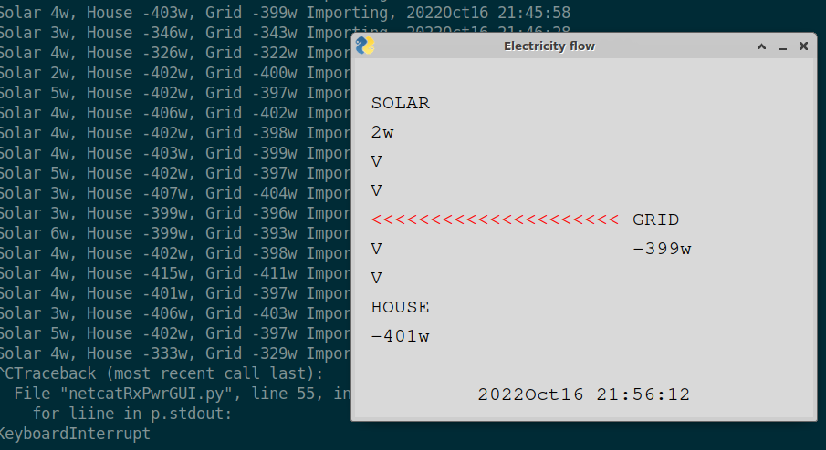

# houseSolarEnergyDisplay
## Overview
An emonPi https://guide.openenergymonitor.org/technical/emonpi/ monitors energy being used and energy from a solar array
Export or Import from a mains supply (Electricity company) also occurs
With a minor modification to an emonPi python file this suite of programs allows display of another device (e.g. laptop)
on same LAN as the emonPi

### Modification to emonPi program
here here
```
Sample text here...
```
#### Slow Refresh
here here
```
Sample text here...
```
#### Fast Refresh
here here
```
Sample text here...
```

## Transmitter
python3 netcatRxTx.py -t

## Terminal Receiver
python3 netcatRxTx.py -r

## Graphical Receiver





