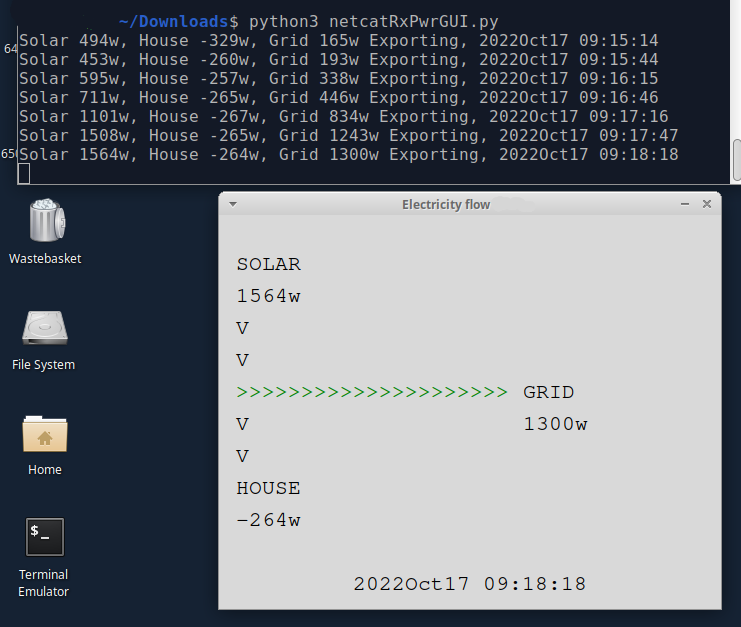

# houseSolarEnergyDisplay
##Overview
An emonPi https://guide.openenergymonitor.org/technical/emonpi/ monitors energy being used and energy from a solar array
Export or Import from a mains supply (Electricity company) also occurs
With a minor modification to an emonPi python file this suite of programs allows display of another device (e.g. laptop)
on same LAN as the emonPi

## Transmitter

## Terminal Receiver

## Graphical Receiver

